# 🚀 Prometheus + Grafana Monitoring on AWS EC2
## AWS CLI + Node.js + Prometheus + Grafana + Node Exporter

---

# 📌 Project Overview

This project demonstrates how to build a production-style monitoring stack on AWS using:

- AWS EC2
- AWS CLI
- Prometheus
- Grafana
- Node Exporter
- Node.js Application Metrics

You will learn how to:

- Deploy a Node.js monitoring application
- Monitor infrastructure health
- Visualize metrics using Grafana dashboards
- Configure Prometheus alerting
- Trigger real-time alerts
- Understand production monitoring workflows

---

# 🌍 Real-World Scenario

You work as a Junior DevOps Engineer at **Auemeribe Tech**.

Your company deployed an application to AWS, but nobody can answer critical operational questions:

- Is the server healthy?
- Is CPU usage too high?
- Is the application receiving traffic?
- How do we detect issues before downtime?

Your responsibility is to implement a complete monitoring solution using:

- Prometheus
- Grafana
- Node Exporter

---

# 🎯 Objectives

By the end of this project, you will:

- Deploy a Node.js monitoring application
- Install Prometheus on AWS EC2
- Install Grafana dashboards
- Monitor server metrics
- Monitor application metrics
- Configure Prometheus alerting
- Trigger real alerts
- Understand real-world monitoring workflows

---

# 🧱 Architecture

```text
Node.js Application
        ↓
Node Exporter
        ↓
Prometheus
        ↓
Grafana Dashboards
        ↓
DevOps Engineer
```

---

# 🏗️ Architecture Diagram (Graphviz)

Save as:

```text
docs/architecture.dot
```

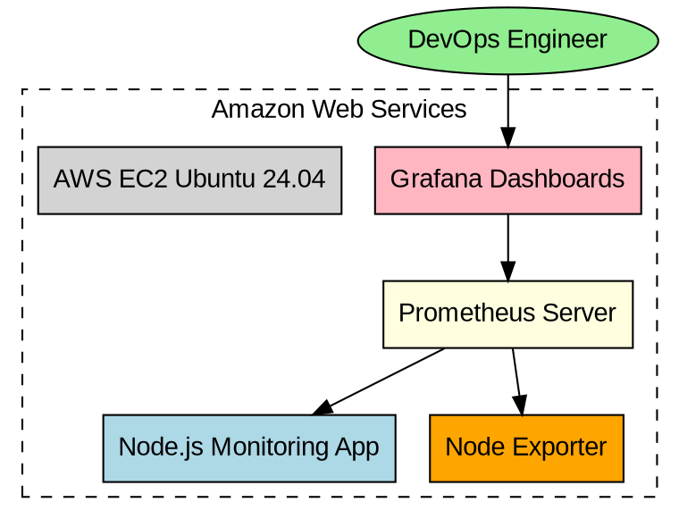
```dot
digraph PROMETHEUS_GRAFANA_AWS {
    rankdir=TB;
    fontname="Arial";

    node [
        shape=box,
        style=filled,
        fontname="Arial"
    ];

    user [
        label="DevOps Engineer",
        shape=ellipse,
        fillcolor="lightgreen"
    ];

    app [
        label="Node.js Monitoring App",
        fillcolor="lightblue"
    ];

    exporter [
        label="Node Exporter",
        fillcolor="orange"
    ];

    prometheus [
        label="Prometheus Server",
        fillcolor="lightyellow"
    ];

    grafana [
        label="Grafana Dashboards",
        fillcolor="lightpink"
    ];

    ec2 [
        label="AWS EC2 Ubuntu 24.04",
        fillcolor="lightgrey"
    ];

    user -> grafana;
    grafana -> prometheus;
    prometheus -> exporter;
    prometheus -> app;

    subgraph cluster_aws {
        label="Amazon Web Services";
        style=dashed;

        ec2;
        app;
        exporter;
        prometheus;
        grafana;
    }
}
```
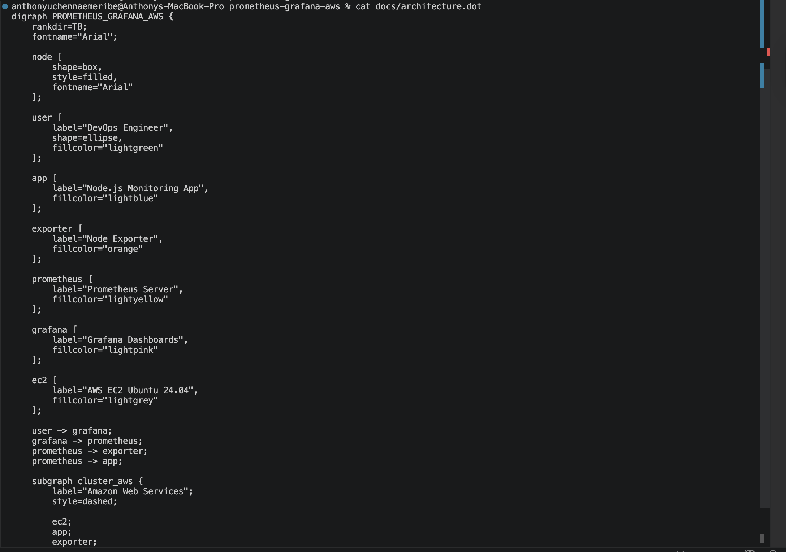

Generate architecture image:

```bash
dot -Tpng docs/architecture.dot -o docs/architecture-diagram.png
```

Open image:

```bash
open docs/architecture-diagram.png
```
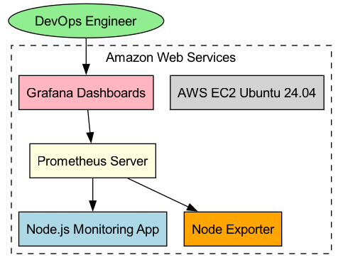
---

# 📁 Project Structure

```text
prometheus-grafana-aws/
├── screenshots/
├── docs/
│   └── architecture.dot
│
├── app/
│   ├── index.js
│   ├── package.json
│   └── package-lock.json
│
├── README.md
└── .gitignore
```

---

# 📄 .gitignore

Create:

```text
.gitignore
```

Add:

```gitignore
node_modules/
.env
.DS_Store
npm-debug.log
*.log
*.pem
*.key
```
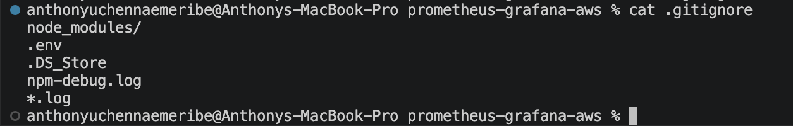
---

# ☁️ PART 1 — CREATE AWS EC2 INSTANCE

---

# Step 1 — Configure AWS CLI

1. Install AWS CLI:

```bash
brew install awscli
```

2. Verify installation:

```bash
aws --version
```
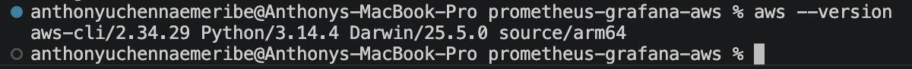

3. Configure credentials:

```bash
aws configure
```

4. Provide:
- AWS Access Key
- AWS Secret Key
- Default region
- Output format

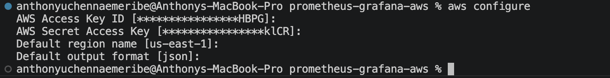
---

# Step 2 — Create Key Pair
1. Run:
```bash
aws ec2 create-key-pair --key-name monitoring-key --query 'KeyMaterial' --output text > monitoring-key.pem
```

2. Secure the key:

```bash
chmod 400 monitoring-key.pem
```
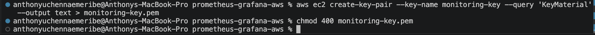
---

# Step 3 — Create Security Group
1. Run
```bash
aws ec2 create-security-group --group-name monitoring-sg --description "Monitoring Security Group"
```
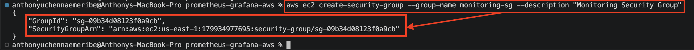

2. Copy the returned GroupId.

---

# Step 4 — Open Required Ports

## SSH

```bash
aws ec2 authorize-security-group-ingress --group-name monitoring-sg --protocol tcp --port 22 --cidr 0.0.0.0/0
```
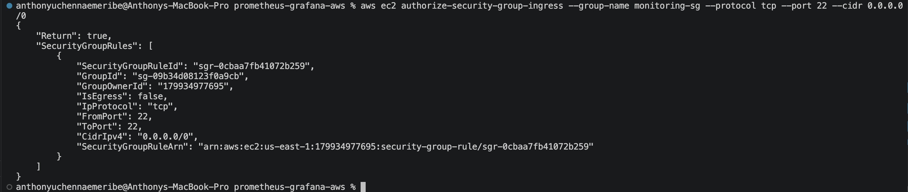

## Node.js Application

```bash
aws ec2 authorize-security-group-ingress --group-name monitoring-sg --protocol tcp --port 3000 --cidr 0.0.0.0/0
```
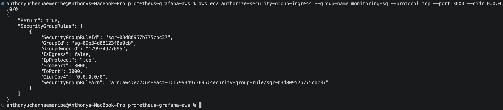

## Prometheus

```bash
aws ec2 authorize-security-group-ingress --group-name monitoring-sg --protocol tcp --port 9090 --cidr 0.0.0.0/0
```
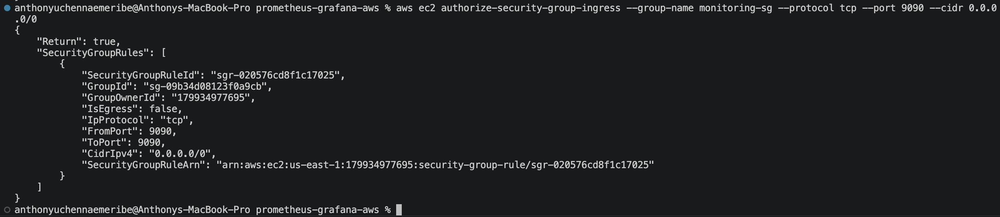

## Grafana

```bash
aws ec2 authorize-security-group-ingress --group-name monitoring-sg --protocol tcp --port 3001 --cidr 0.0.0.0/0
```
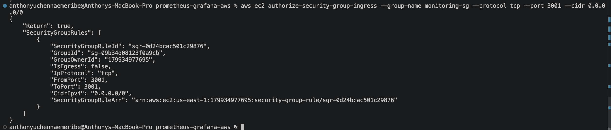

## Node Exporter

```bash
aws ec2 authorize-security-group-ingress --group-name monitoring-sg --protocol tcp --port 9100 --cidr 0.0.0.0/0
```
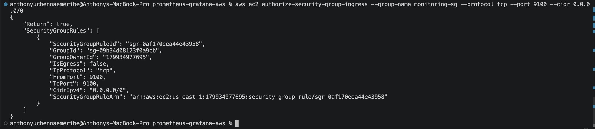
---

# Step 5 — Launch EC2 Instance
1. For Ubuntu 24.04 LTS, run this:
```bash
aws ec2 describe-images --owners 099720109477 --filters "Name=name,Values=ubuntu/images/hvm-ssd-gp3/ubuntu-noble-24.04-amd64-server-*" "Name=architecture,Values=x86_64" "Name=virtualization-type,Values=hvm" --query "Images | sort_by(@, &CreationDate)[-1].ImageId" --output text
```
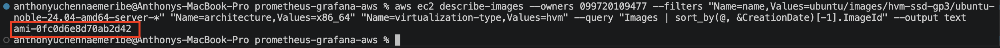

2. Run with the retrieved AMI ID.
```bash
aws ec2 run-instances --image-id ami-0fc0d6e8d70ab2d42 --count 1 --instance-type t3.micro --key-name monitoring-key --security-groups monitoring-sg
```
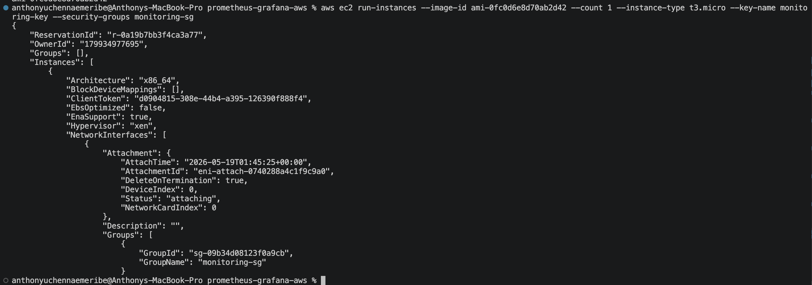

---

# Step 6 — Get Public IP

```bash
aws ec2 describe-instances --query "Reservations[*].Instances[*].PublicIpAddress" --output text
```

Save the public IP.

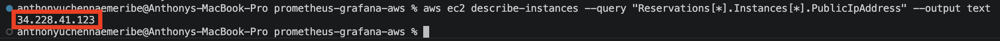

---

# 🔑 PART 2 — CONNECT TO EC2

```bash
ssh -i monitoring-key.pem ubuntu@YOUR_PUBLIC_IP

# Substituting YOUR_PUBLIC_IP
ssh -i monitoring-key.pem ubuntu@34.228.41.123
```
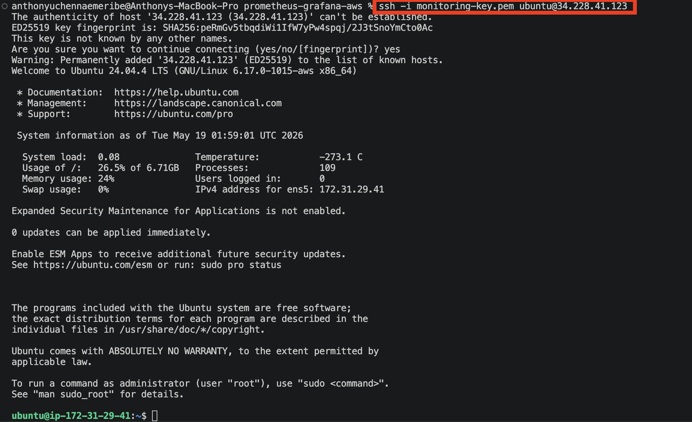

---

# ⚙️ PART 3 — INSTALL BASIC TOOLS

```bash
sudo apt update

sudo apt install -y wget curl git unzip
```
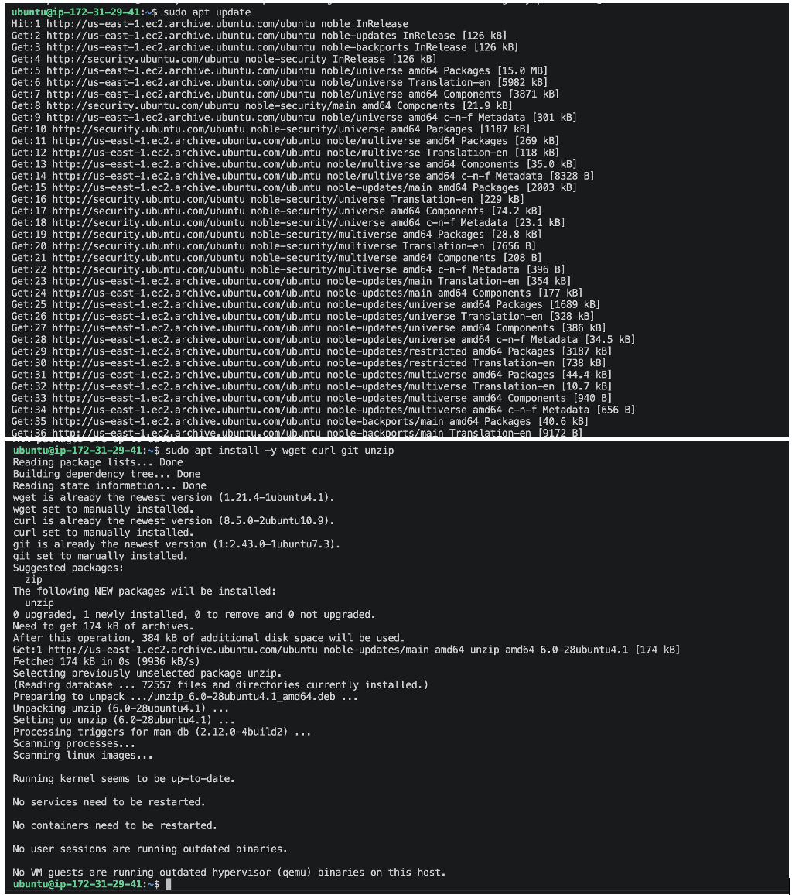
---

# 🟢 PART 4 — INSTALL NODE.JS

---

# Step 1 — Install Node.js

```bash
curl -fsSL https://deb.nodesource.com/setup_20.x | sudo -E bash -
```

```bash
sudo apt install -y nodejs
```
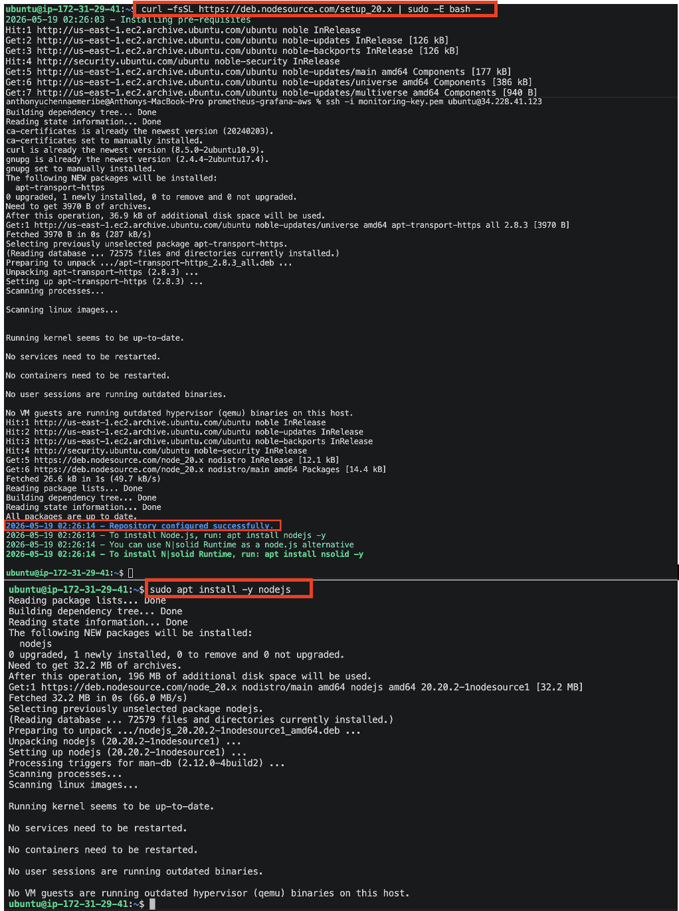

Verify installation:

```bash
node -v

npm -v
```
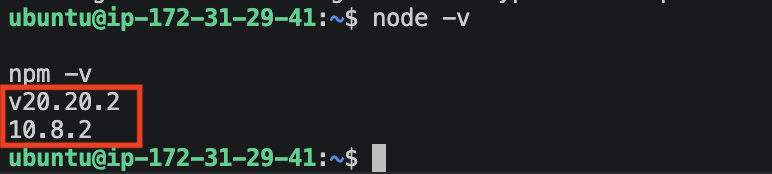
---

# 📦 PART 5 — CREATE MONITORING APPLICATION

---

# Step 1 — Create Project Folder

```bash
mkdir app

cd app
```
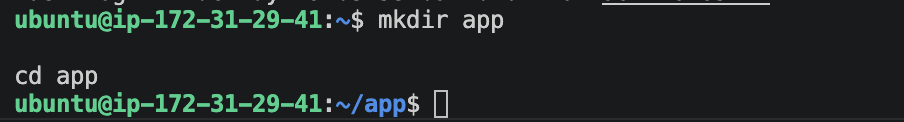
---

# Step 2 — Initialize Application

```bash
npm init -y
```

Install dependencies:

```bash
npm install express prom-client
```
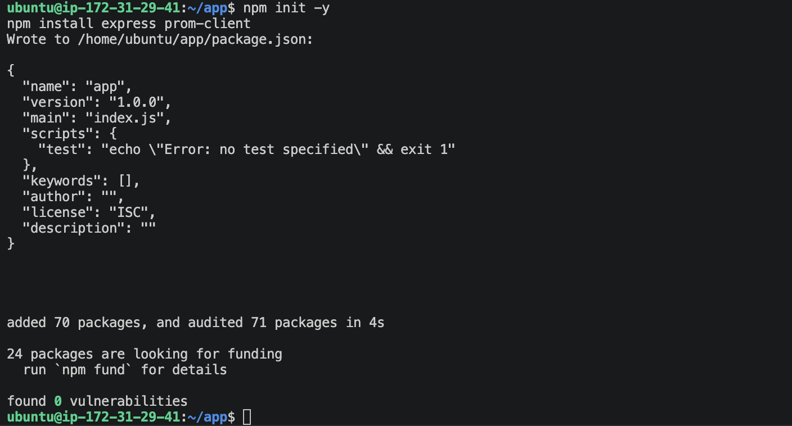

---

# Step 3 — Create Application File

```bash
nano index.js
```

Paste:

```javascript
const express = require('express');
const client = require('prom-client');

const app = express();

client.collectDefaultMetrics();

const counter = new client.Counter({
  name: 'http_requests_total',
  help: 'Total number of requests'
});

app.get('/', (req, res) => {
  counter.inc();
  res.send('Monitoring App Running');
});

app.get('/metrics', async (req, res) => {
  res.set('Content-Type', client.register.contentType);
  res.end(await client.register.metrics());
});

app.listen(3000, () => {
  console.log('App running on port 3000');
});
```
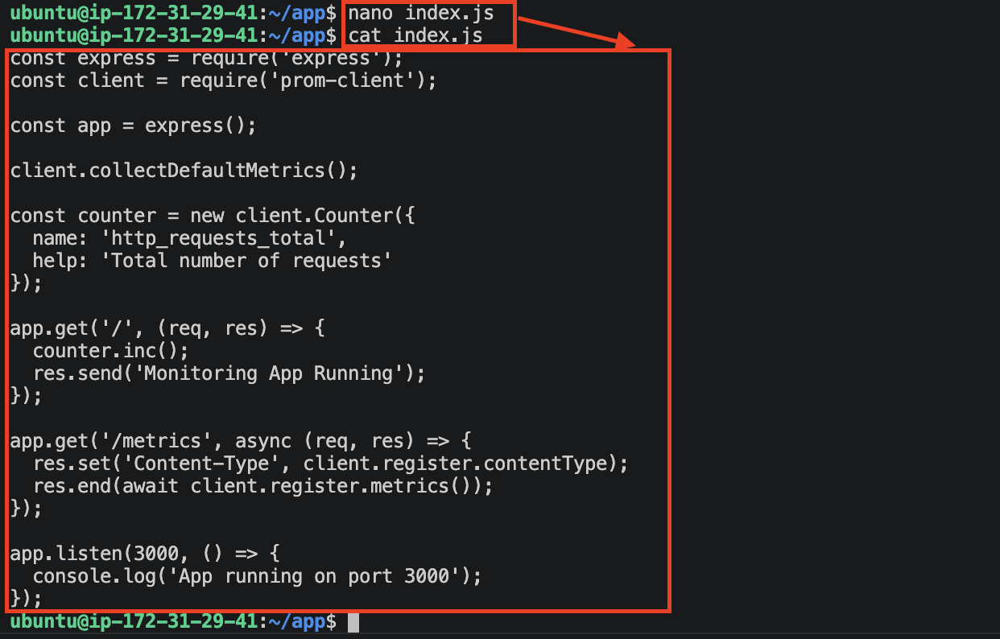
---

# Step 4 — Start Application

```bash
node index.js
```

---

# Step 5 — Verify Application

Open:

```text
http://EC2_PUBLIC_IP:3000

# Substituting EC2_PUBLIC_IP
http://34.228.41.123:3000
```

Expected:

```text
Monitoring App Running
```
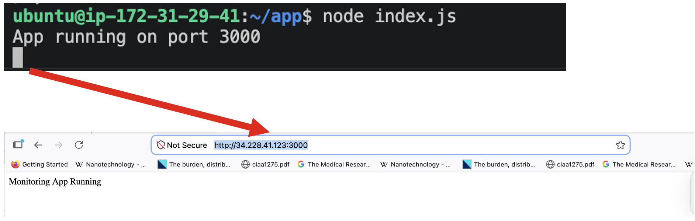
---

# Step 6 — Verify Metrics Endpoint

Open:

```text
http://EC2_PUBLIC_IP:3000/metrics

# Substituting EC2_PUBLIC_IP
http://34.228.41.123:3000/metrics
```

Prometheus metrics should appear.

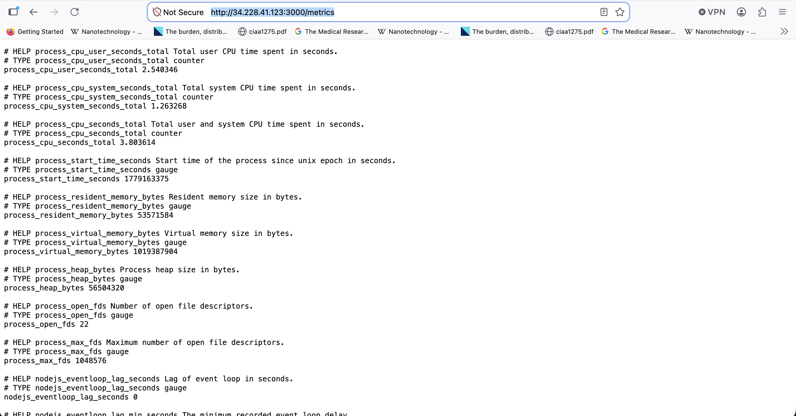
---

# 📊 PART 6 — INSTALL NODE EXPORTER

---

# Step 1 — Download Node Exporter

```bash
cd ~
```

```bash
wget https://github.com/prometheus/node_exporter/releases/download/v1.11.1/node_exporter-1.11.1.linux-amd64.tar.gz
```
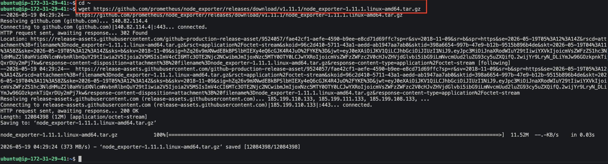

---

# Step 2 — Extract

```bash
tar -xvf node_exporter-1.11.1.linux-amd64.tar.gz
```
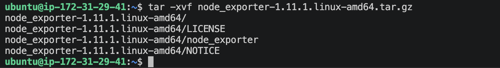

---

# Step 3 — Start Node Exporter

```bash
cd node_exporter-1.11.1.linux-amd64
```

```bash
./node_exporter
```

---

# Step 4 — Verify Exporter

Open:

```text
http://EC2_PUBLIC_IP:9100/metrics

# Substituting EC2_PUBLIC_IP
http://34.228.41.123:9100/metrics
```
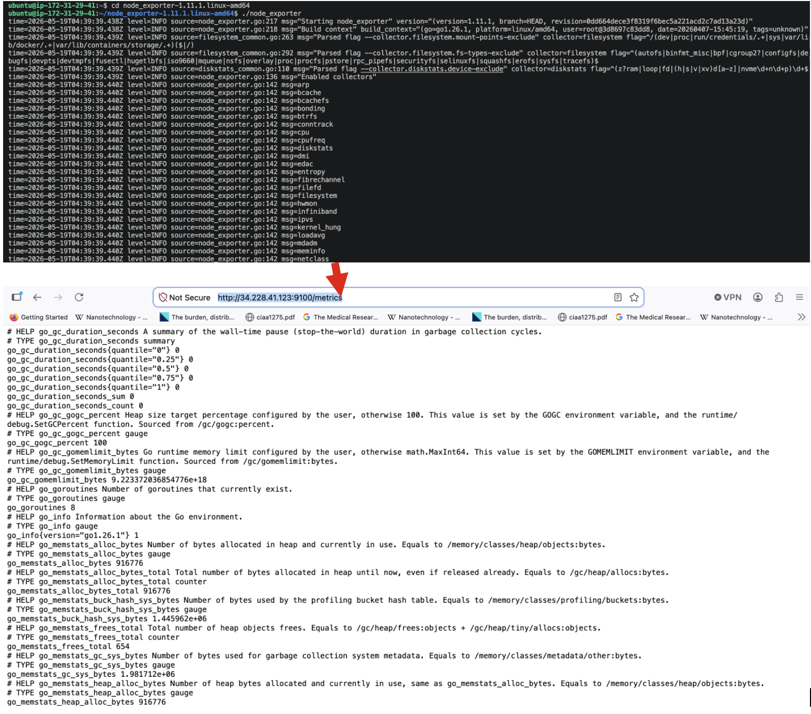
---

# 🧠 PART 7 — INSTALL PROMETHEUS

---

# Step 1 — Download Prometheus

```bash
cd ~
```

```bash
wget https://github.com/prometheus/prometheus/releases/download/v3.11.3/prometheus-3.11.3.linux-amd64.tar.gz
```
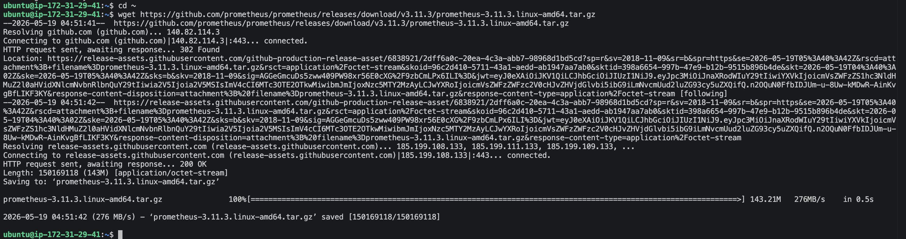
---

# Step 2 — Extract

```bash
tar -xvf prometheus-3.11.3.linux-amd64.tar.gz
```
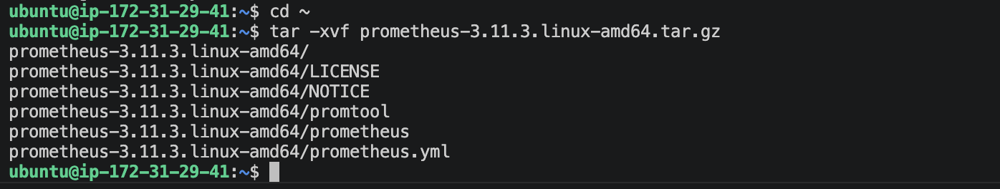
---

# Step 3 — Open Prometheus Folder

```bash
cd prometheus-3.11.3.linux-amd64
```
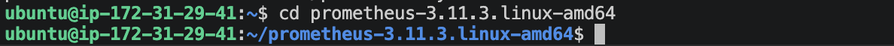

---

# Step 4 — Configure Prometheus

```bash
nano prometheus.yml
```

Replace scrape_configs with:

```yaml
scrape_configs:
  - job_name: 'node_app'
    static_configs:
      - targets: ['localhost:3000']

  - job_name: 'node_exporter'
    static_configs:
      - targets: ['localhost:9100']
```
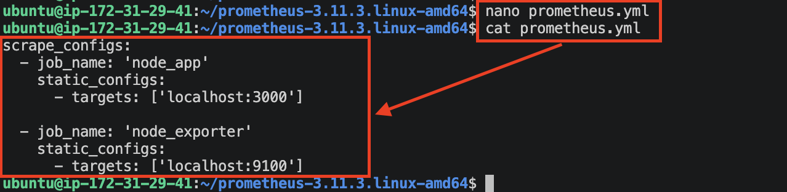
---

# Step 5 — Start Prometheus

```bash
./prometheus --config.file=prometheus.yml
```
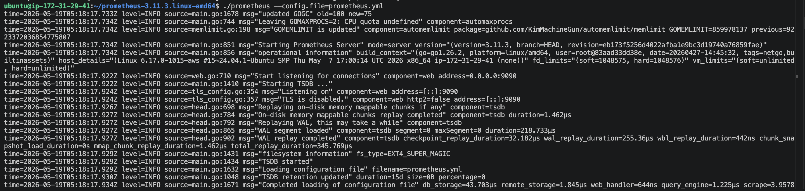
---

# Step 6 — Verify Prometheus

Open:

```text
http://EC2_PUBLIC_IP:9090

# Substituting EC2_PUBLIC_IP
http://34.228.41.123:9090
```
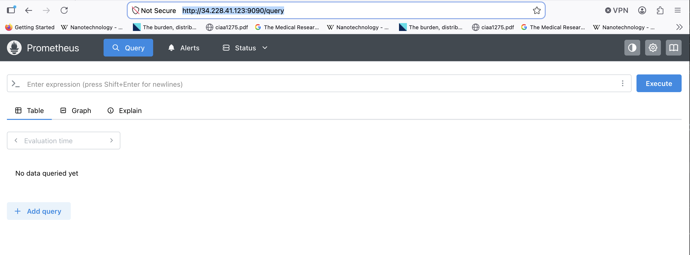
---

# Step 7 — Verify Targets

Go to:

```text
Status → Targets
```

Expected:

```text
UP
UP
```
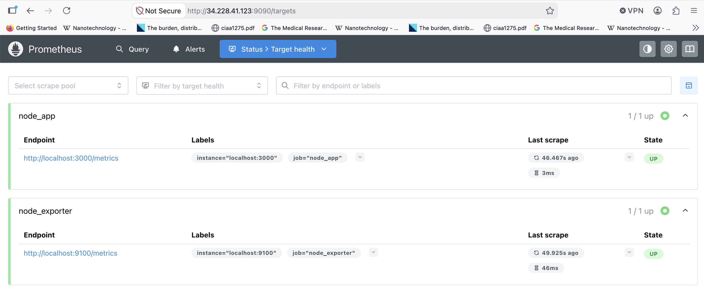
---

# 📈 PART 8 — INSTALL GRAFANA

---

# Step 1 — Install Grafana

```bash
sudo apt update
```

```bash
sudo apt install -y apt-transport-https software-properties-common wget
```

```bash
sudo mkdir -p /etc/apt/keyrings/
```

```bash
wget -q -O - https://apt.grafana.com/gpg.key | \
gpg --dearmor | sudo tee /etc/apt/keyrings/grafana.gpg > /dev/null
```

```bash
echo "deb [signed-by=/etc/apt/keyrings/grafana.gpg] https://apt.grafana.com stable main" | \
sudo tee /etc/apt/sources.list.d/grafana.list
```

```bash
sudo apt update
```

```bash
sudo apt install grafana -y
```
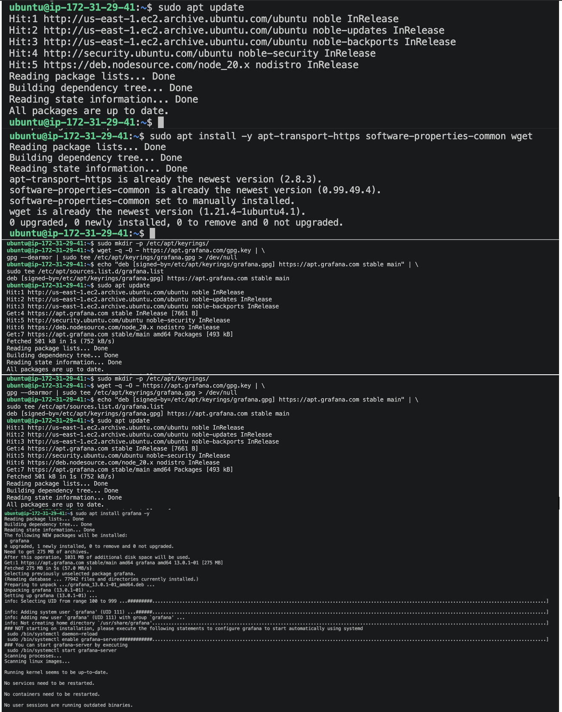
---

# Step 2 — Change Grafana Port

```bash
sudo nano /etc/grafana/grafana.ini
```

Find:

```ini
;http_port = 3000
```

Replace with:

```ini
http_port = 3001
```
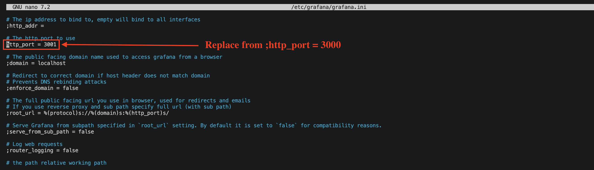
---

# Step 3 — Start Grafana

```bash
sudo systemctl start grafana-server
```

```bash
sudo systemctl enable grafana-server
```
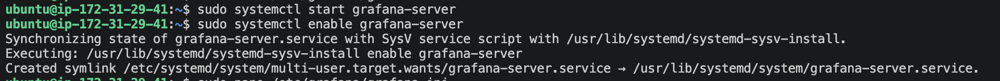
---

# Step 4 — Access Grafana

Open:

```text
http://EC2_PUBLIC_IP:3001

# Substituting EC2_PUBLIC_IP
http://34.228.41.123:3001
```

Login:

```text
admin
admin
```

Grafana will request password change on first login.

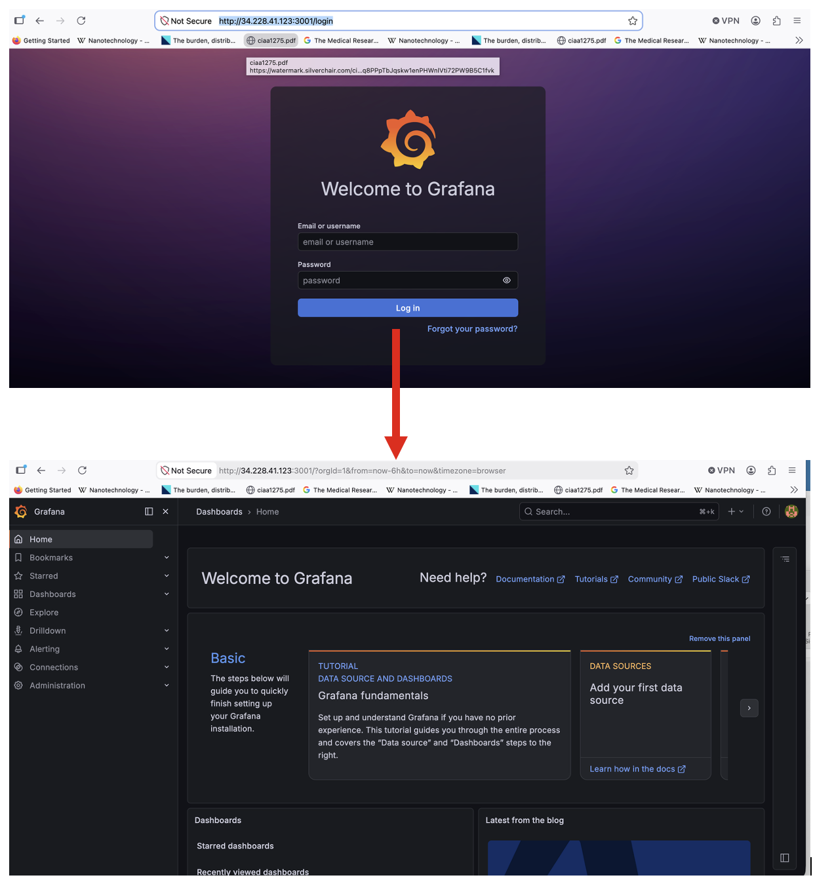
---

# 🔗 PART 9 — CONNECT GRAFANA TO PROMETHEUS

---

# Step 1 — Add Data Source

Go to:

```text
Connections → Data Sources
```

Add:

```text
Prometheus
```

---

# Step 2 — Configure URL

Use:

```text
http://localhost:9090
```

Click:

```text
Save & Test
```

Expected:

```text
Data source is working
```
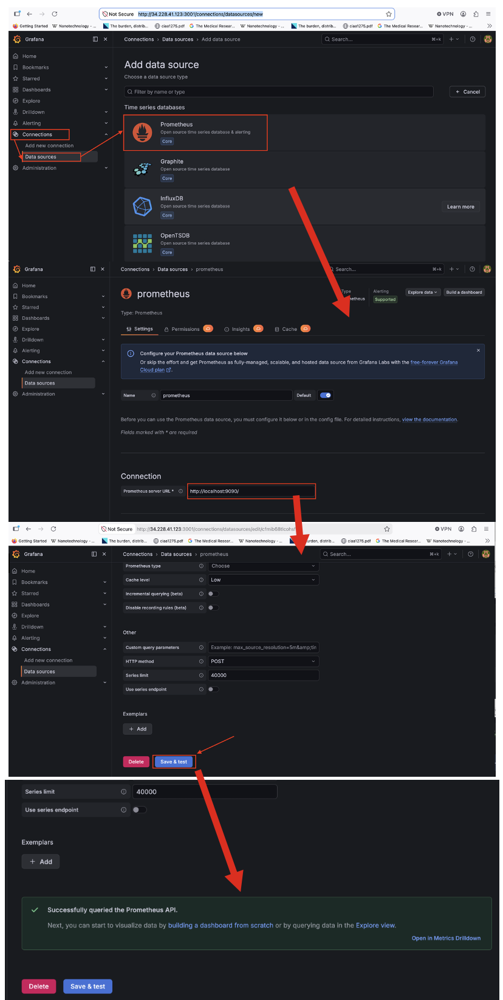
---

# 📊 PART 10 — CREATE DASHBOARDS

## Step 1 - Open:
```text
http://34.228.41.123:3001
```
Login with:
```text
admin
```
and your password.
---

## Step 2 - Click the Blue ➕ Panel Button:

1. On the right side of the dashboard page, select:
```text
Dashboards → New → New Dashboard
```

2. Select:
```text
Blue ➕ icon
```

3. under:
```text
Panel
```

4. Click it once.

## Step 2 — Select Prometheus Data Source

1. After clicking the ➕ button, Grafana opens the query editor.

2. You’ll see a dropdown near the bottom/top area labeled something like:
```text
Data source
```
3. Click the dropdown and select:
```text
prometheus
```
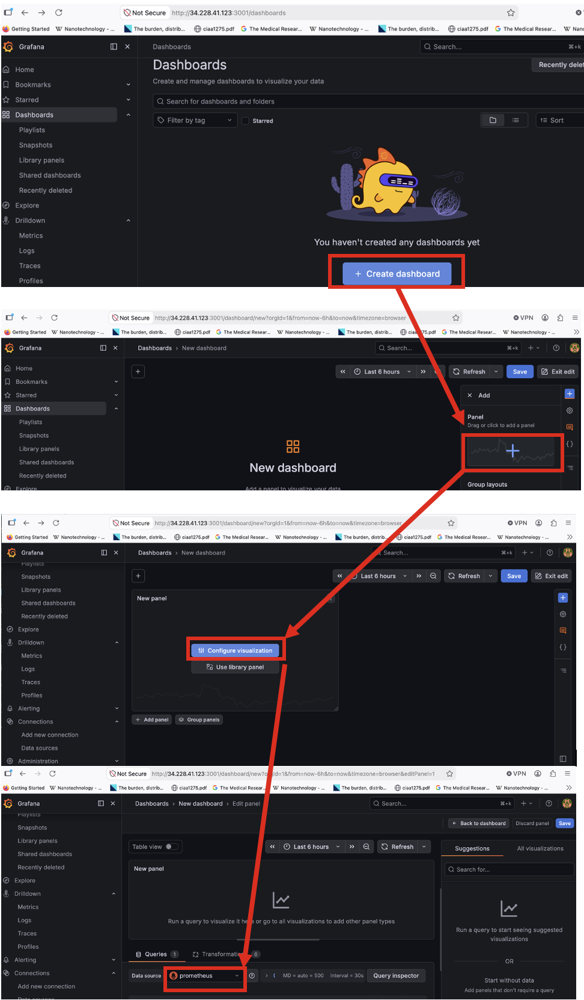

## Step 3 — Paste CPU Query

1. Inside the query box, paste:
```promql
rate(node_cpu_seconds_total[1m])
```
2. Then click:
```text
Run queries
```
3. Alternatively, press:
```text
Shift + Enter
```
4. You should immediately see graph lines appear.
---
## Step 4 — Apply Visualization
1. Top-right corner:
```text
Apply
```
2. Click it.

3. Now your first dashboard panel is created.

## Step 5 — Add More Panels
1. Repeat the same process for:

# Memory Usage
```promql
node_memory_MemAvailable_bytes
```
---

# Application Requests Query

Add another visualization by pasting:
```promql
rate(http_requests_total[1m])
```
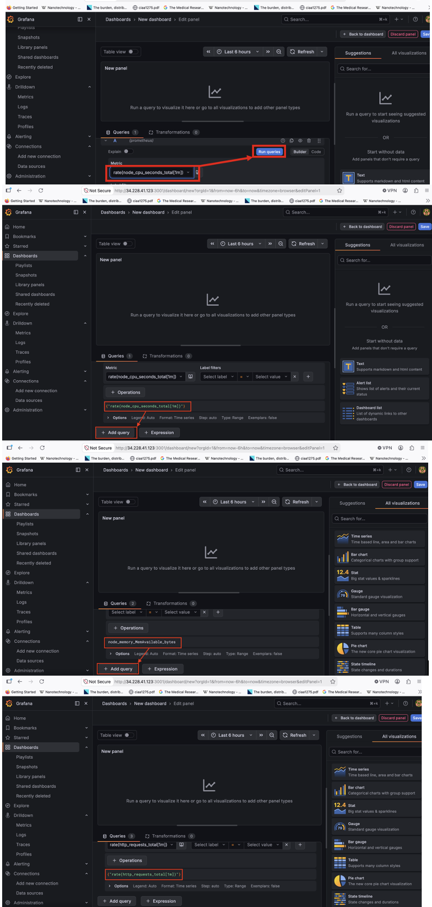

## Step 6 — Save Dashboard

1. Top-right:
```text
Save dashboard
```
2. Dashboard name:
```text
AWS Monitoring Dashboard
```
3. Click
```text
Save
```
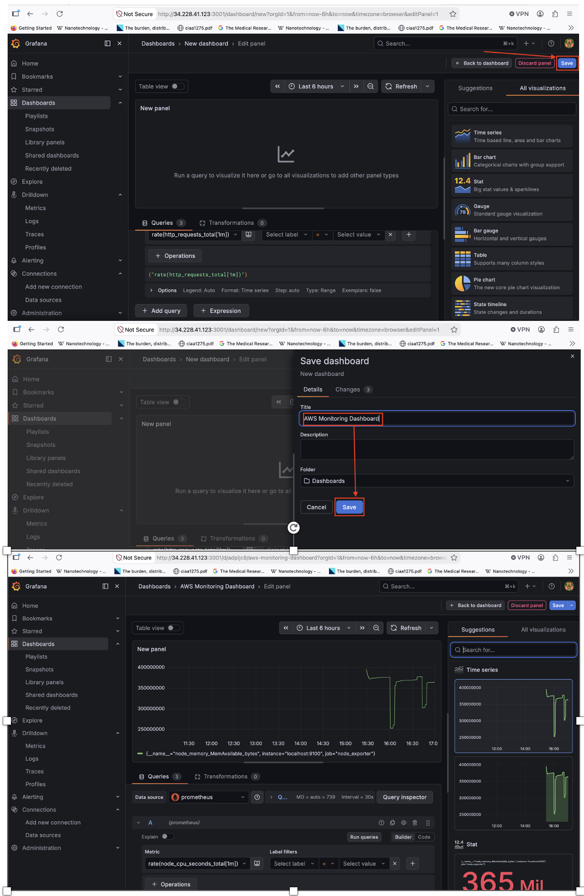
---

# 🚨 PART 11 — VERIFY MONITORING

---

# Step 1 — Generate Traffic

1. Inside EC2 terminal, run:
```bash
while true; do curl http://localhost:3000; done
```
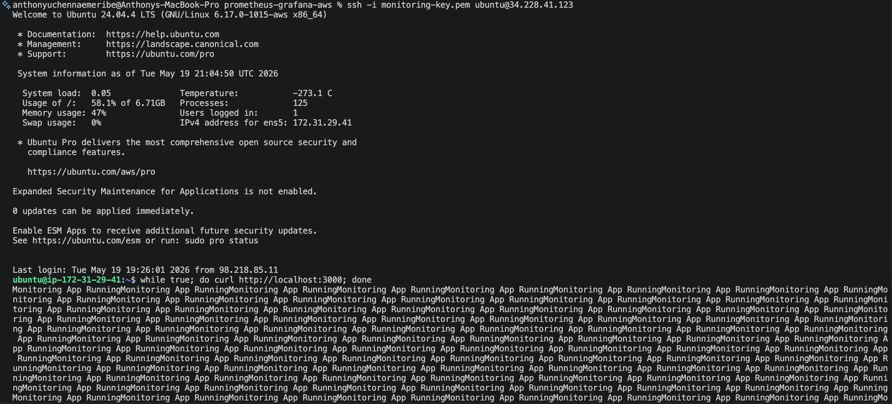

2. This continuously hits your Node.js application.
---

# Step 2 — Observe Grafana Dashboards

You should now see:

- CPU metrics changing
- Memory activity
- Request metrics increasing

This confirms live monitoring is working.
---
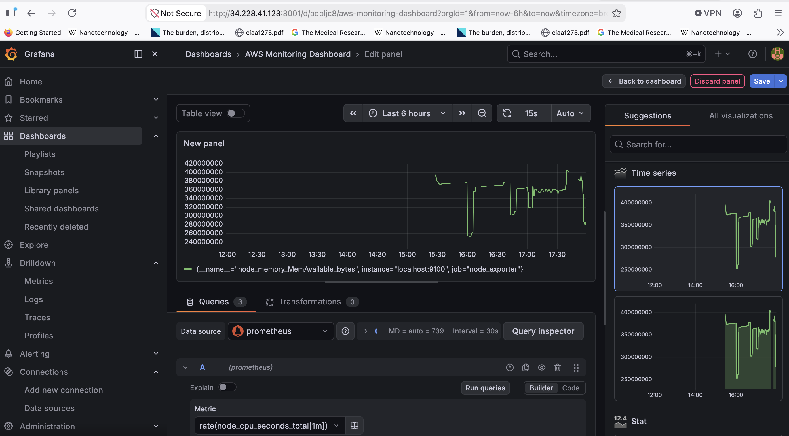

# 🚨 PART 12 — ADD ALERTING

---

# Step 1 — Create Alert Rule File

1. Log into the VM in the terminal with prometheus running after stopping the process with ctrl + c, then proceed:
```bash
ssh -i monitoring-key.pem ubuntu@34.228.41.123
```

2. Go Into Prometheus Folder, inside EC2:
```bash
cd ~/prometheus-3.11.3.linux-amd64
```

3. Create Alert Rules File
```bash
nano alert.rules.yml
```

4. Paste:

```yaml
groups:
  - name: monitoring-alerts
    rules:

      - alert: HighCPUUsage
        expr: rate(node_cpu_seconds_total[1m]) > 0.5
        for: 1m
        labels:
          severity: warning
        annotations:
          summary: "High CPU Usage Detected"
          description: "CPU usage is above 50%"
```
5. Save File
```bash
Crtl X
Y
Enter
```
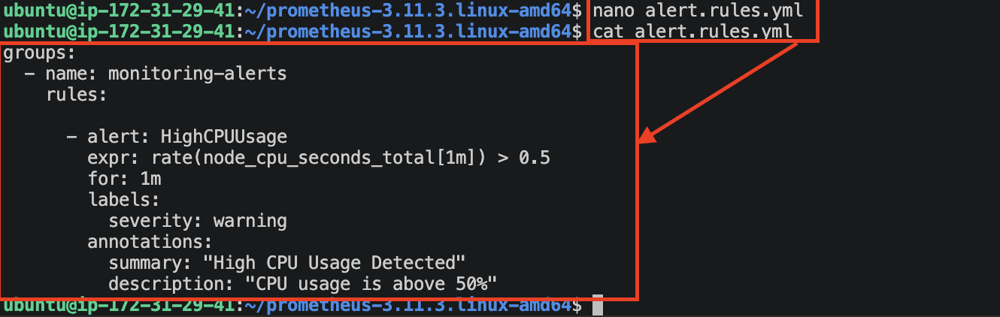
---

# Step 2 — Connect Alert Rules

1. Edit Prometheus config:

```bash
nano prometheus.yml
```

2. Add THIS above scrape_configs:
```yaml
rule_files:
  - "alert.rules.yml"
```

3. Your file should look similar to:
```yaml
global:
  scrape_interval: 15s

rule_files:
  - "alert.rules.yml"

scrape_configs:
  - job_name: 'node_app'
    static_configs:
      - targets: ['localhost:3000']

  - job_name: 'node_exporter'
    static_configs:
      - targets: ['localhost:9100']
```
4. Save File
```bash
Crtl X
Y
Enter
```
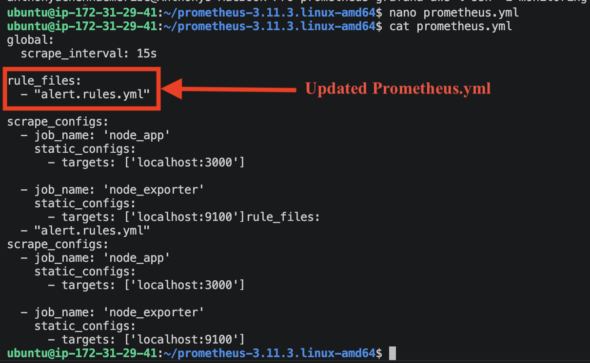

---

# Step 3 — Restart Prometheus

1. Stop Prometheus:

```text
CTRL + C
```

2. Restart:

```bash
./prometheus --config.file=prometheus.yml
```
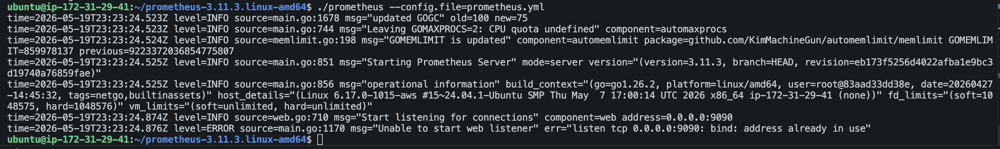

# Troubleshooting

3. Inside EC2 terminal run:
```bash
pkill prometheus
```
4. Now verify it stopped:
```bash
ps aux | grep prometheus
```
5. Still inside the VM, restart prometheus once again:
```bash
./prometheus --config.file=prometheus.yml
```
6. Leave this running.

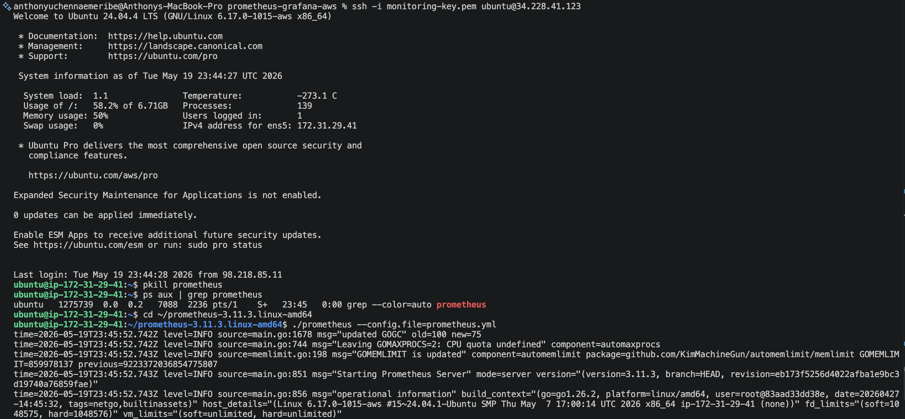
---

# Step 4 — Verify Alerts

1. Open:

```text
http://EC2_PUBLIC_IP:9090

http://34.228.41.123:9090
```

2. Go to:

```text
Alerts
```

3. Expected:

```text
HighCPUUsage
Status: Inactive
```
4. That is GOOD.

5. It means the rule loaded successfully.

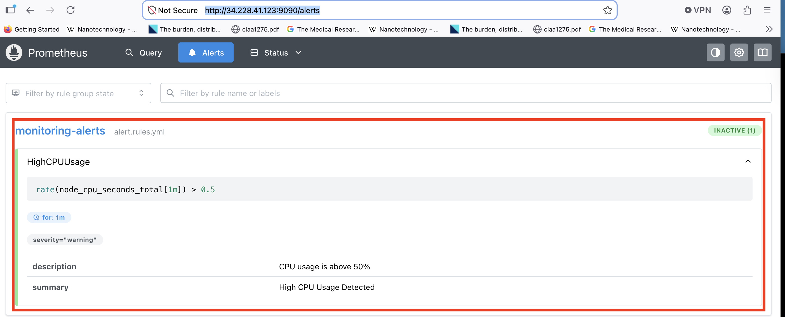
---

# Step 5 — Trigger High CPU Usage
1. Open NEW EC2 terminal tab/session using:
```bash
ssh -i monitoring-key.pem ubuntu@34.228.41.123 
```
2. Install stress tool:

```bash
sudo apt install stress -y
```
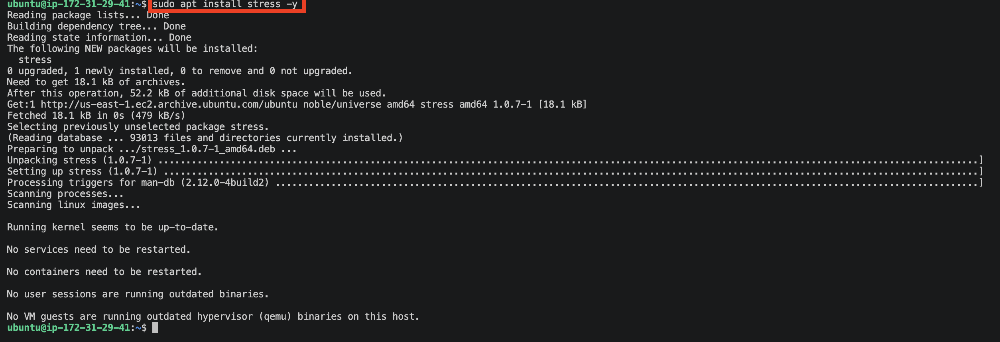

3. Generate CPU load, by running CPU stress:

```bash
stress --cpu 2 --timeout 120
```
This intentionally overloads CPU for 2 minutes.
---

# Step 6 — Verify Alert Fires

Go back to:

```text
http://34.228.41.123:9090

Or

Prometheus → Alerts
```

Expected:

```text
Status: Firing
```

🎉 SUCCESS!

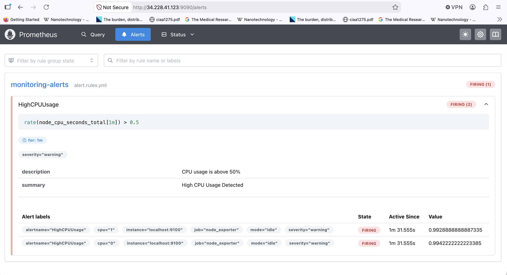

# Update GitHub

1. Authenticate GitHub CLI:

```bash
gh auth login
```
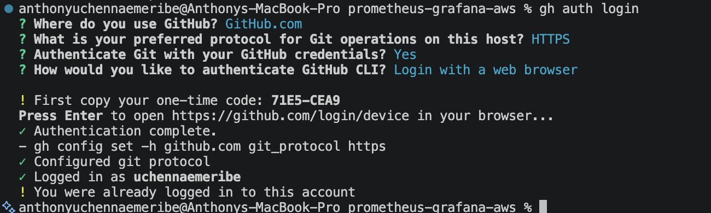

2. Initialize Git:

```bash
git init
```

3. Add files:

```bash
git add .
```
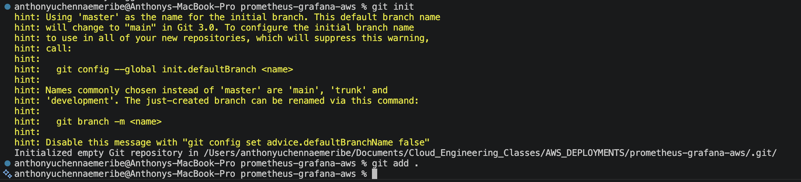

4. Commit:

```bash
git commit -m "Prometheus-Grafana-AWS"
```
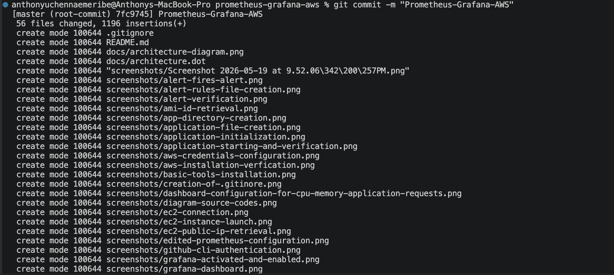

5. Rename branch:

```bash
git branch -M main
```

6. Create GitHub repository:

```bash
gh repo create prometheus-grafana-aws --public --source=. --remote=origin --push
```
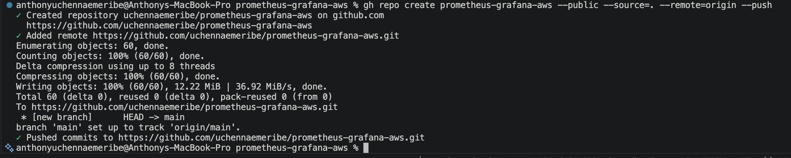
---

# 🧠 CONCEPT VERIFICATION

| Concept | Verification |
|---|---|
| Metrics | `/metrics` endpoint |
| Prometheus Scraping | Targets = UP |
| System Monitoring | Node Exporter |
| Visualization | Grafana Dashboards |
| Application Metrics | Request Counter |
| Alerting | HighCPUUsage Alert |
| Real-Time Monitoring | Live Traffic Testing |

---

# 🎯 FINAL OUTCOME

You now understand:

✅ What monitoring is  
✅ How Prometheus scrapes metrics  
✅ How exporters work  
✅ How Grafana visualizes metrics  
✅ How alerting works  
✅ How real-time monitoring operates in production environments  

---

# 🧹 CLEANUP
1. 
```bash
aws ec2 describe-security-groups --filters Name=group-name,Values='*' --query "SecurityGroups[?GroupName!='default'].[GroupId,GroupName,VpcId]" --output table
aws ec2 delete-security-group --group-id sg-09b34d08123f0a9cb
```
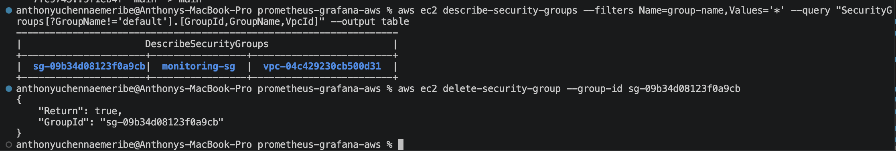

2. Terminate the EC2 instance when done:

```bash
aws ec2 describe-instances --query "Reservations[*].Instances[*].[InstanceId,PublicIpAddress,State.Name]" --output table
aws ec2 terminate-instances --instance-ids i-0c34176b792d0a7bd
```
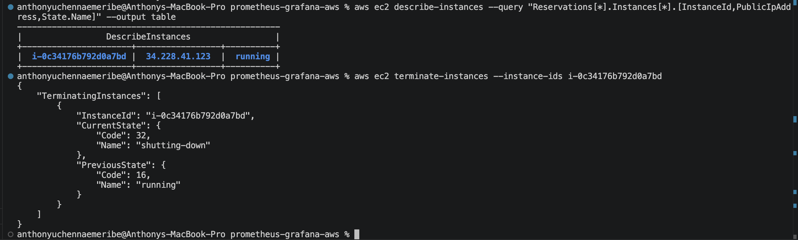
---

# 👤 Author

**Anthony Uchenna Emeribe**  
Cloud / DevOps Engineer

---

# ⭐ Support

If this project helped you learn monitoring and observability, consider giving the repository a ⭐ on GitHub.
